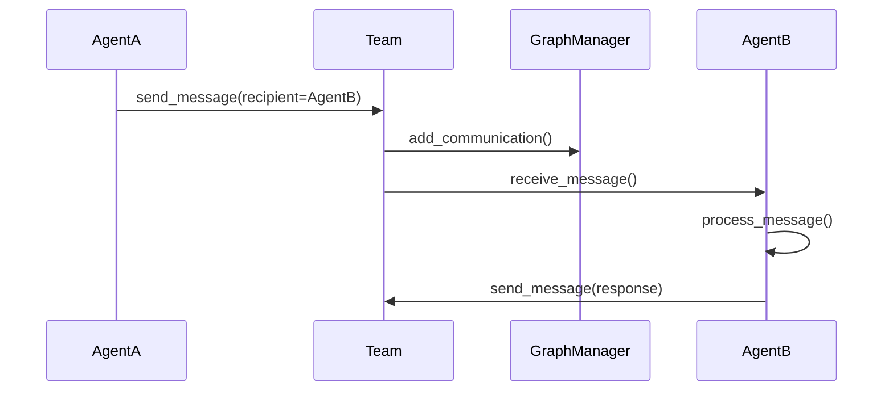
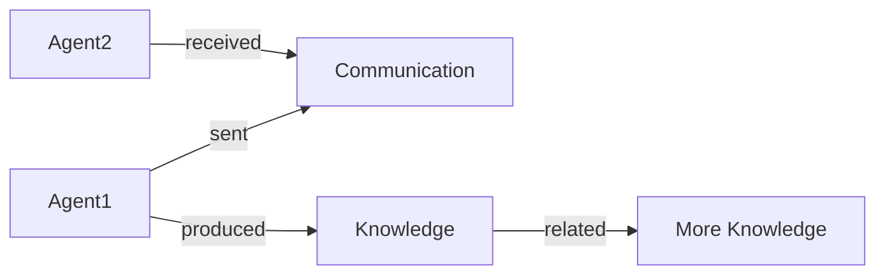

# GraphFusionAI-Lite: A Scalable Multi-Agent Collaboration Framework

GraphFusionAI-Lite is a Python framework for building collaborative multi-agent systems using asynchronous programming and knowledge graphs. It enables AI agents to work together on complex tasks by providing structured communication, task delegation, and shared knowledge management.

## Why GraphFusionAI-Lite?

Modern AI systems often require multiple specialized agents working together. Traditional approaches face challenges with:
- Coordination overhead
- Knowledge siloing
- Scalability limitations
- Concurrency bottlenecks

GraphFusionAI-Lite solves these by providing:
1. **Asynchronous Agent Communication**: Using Python's asyncio for efficient concurrency
2. **Centralized Knowledge Graph**: Enabling agents to share and query information
3. **Team-based Collaboration**: Agents can form dynamic teams for task delegation
4. **Extensible Architecture**: Easy to add new agent capabilities and behaviors

## Core Concepts

### Agents
Agents are autonomous entities that can:
- Execute tasks using capabilities (async or sync)
- Communicate with other agents
- Store and recall information
- Request and provide help

### Teams
Teams coordinate agents by:
- Managing agent membership
- Routing messages between agents
- Tracking task completion
- Maintaining a communication graph

### Knowledge Graph
The graph stores:
- Agent nodes with attributes
- Knowledge nodes (facts, data, insights)
- Communication events
- Relationships between entities

### Asynchronous Architecture
All agent interactions are asynchronous:
- Non-blocking message passing
- Concurrent task execution
- Efficient resource utilization

## Getting Started

### Installation
```bash
git clone https://github.com/your-username/GraphFusionAI-Lite.git
cd GraphFusionAI-Lite
pip install -e .
```

### Running the Demo
```bash
python examples/team_demo.py
```

## Architecture Deep Dive

### Agent Lifecycle
1. Agent created with capabilities
2. Added to a team via `team.add_agent(agent)`
3. Receives tasks via `agent.execute_task()`
4. Can request help via `agent.request_help()`
5. Completes tasks and reports results

### Message Flow


### Knowledge Graph Structure


## Advanced Usage

### Creating Custom Agents
```python
class ResearchAgent(Agent):
    def __init__(self, agent_id):
        super().__init__(agent_id)
        self.add_capability("web_research", self.web_research)
    
    async def web_research(self, topic: str):
        # Implement research logic
        return f"Research on {topic}"
```

### Forming Specialized Teams
```python
async def main():
    team = Team("ResearchTeam", GraphManager())
    researcher = ResearchAgent("Researcher1")
    analyst = AnalysisAgent("Analyst1")
    await team.add_agent(researcher)
    await team.add_agent(analyst)
```

## Contribution Guidelines

We welcome contributions! Please follow these steps:
1. Open an issue describing your proposed change
2. Fork the repository
3. Create a feature branch (`git checkout -b feature/your-feature`)
4. Commit your changes (`git commit -m 'Add amazing feature'`)
5. Push to the branch (`git push origin feature/your-feature`)
6. Open a pull request

## License
MIT License - see [LICENSE](LICENSE) for details
